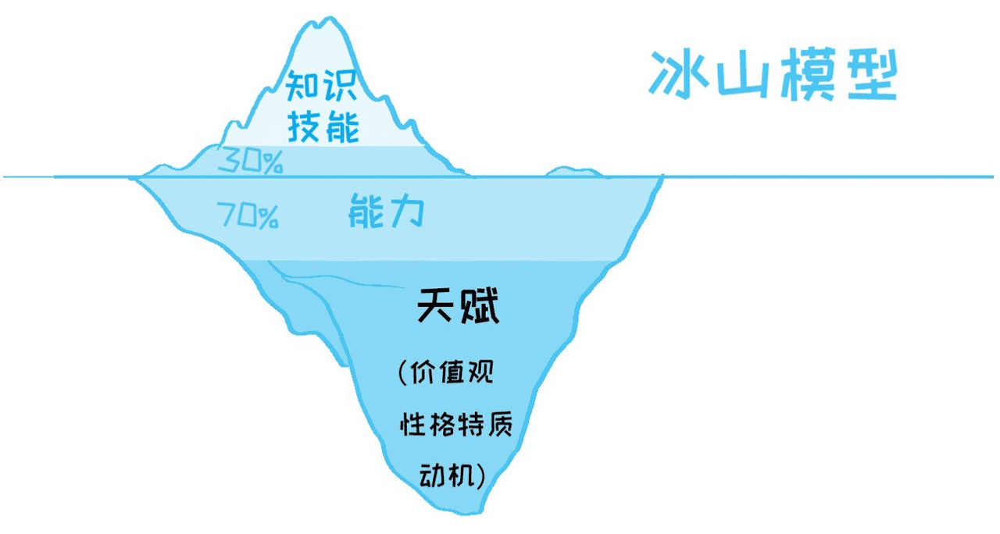

# 经历面试

我没经历过非常多面试，但是大多数面试都有些让人印象深刻的经历。

* 刚毕业的时候，面试一家小公司，面试官问我“会不会Java”，我说“还不会，但是可以学”，然后就面试通过了。
* 第一次跳槽，面试官问我“你吃过什么苦”，我说“我没吃过什么苦”，然后面试失败了。
* 第二次跳槽，一看到面试官发现他是我第一家公司的同事，然后就面试通过了。
* 第三次跳槽，面试官先问我数据结构和算法，过了一会换了个人问了我C的问题，过了一会换了个人来问Java问题，过了一会又来个人问JVM问题，最终换了6个面试官，面了我7个小时。
  * 过了两天，我又收到第7轮面试邀请，来了之后面试官问我“你会不会安卓”，我说“还不会，但是可以学”，然后就面试失败了。
* 还是第三次跳槽，又是各种车轮面试了5轮之后，过了两天让我来面试第六轮，面试官问我“你是从外地来的？”，我说是，然后就面试通过了。

从我的经历来看，每家公司的面试都是流程不确定的、主观性非常强的、结果也很难以预测的事情。因此，我会更多的从面试官的视角来整理面试里需要注意的问题。

## 面试内容

### 知识

#### 基础知识

公司越大，对程序员基础知识的考核越严格。很多人吐槽大公司喜欢“面试造飞机入职拧螺丝”，但是我认为考核要求高的原因很好理解，就像我在前面章节里讲的，基础知识决定了发展上限，而大公司的技术上限高，因此需要招进来更多具备发展潜力的人，来避免人才梯队断档。

不同岗位要求的基础知识会有区别，但是总的来说，数据结构与算法、网络、操作系统与组成原理多少都会涉及到。

这部分内容的考核让程序员面试看起来非常的高大上，网上关于这方面内容的资料也很多，从LeetCode刷题、到书籍、到课程、到经验，该有的都有了。但是基础还是能刷掉很多人，原因主要还是：基础知识不那么容易掌握。

我的建议，一方面是踏实的把基础知识学好（应届生都应该都有足够的学习相关课程和练习的时间）。

另一方面是做一些针对性的练习，推荐书籍是Gayle Laakmann McDowell的《Cracking the Coding Interview: 189 Programming Questions and Solutions》

#### 领域知识

另一方面，还有一部分跟工作岗位相关的领域知识需要了解，来考察你是不是真的“懂”某个东西。

领域知识和基础知识的区别是，前者的考察内容和答案基本上已经非常成熟了，跟高考类似，虽然知识内容是固定的，但是题目经过了多年的筛选，基本上还能反映出应聘者的水平；后者则因为领域非常发散，题目也没有经过太多推敲，更多的是一些浮于表面、死记硬背类的问题。（也就是常见的“八股文”）

从应聘者的角度来看，如果自身在这个领域有一定经验，那么即使答不出非常精确的答案，也能说个大概；即使是没什么经验，大多数的这类问题也能通过短期内的突击解决。

我的建议：没有，我不喜欢考察这个。

### 技能

#### 项目级别与角色

大多数面试都会问到简历里的项目经历，本质上要搞清楚两件事：

* 他在做的是一件什么样的事情
* 他在项目里是扮演了什么角色

前者很好理解，同样是程序开发，有简单程序、也有复杂程序，参与开发复杂程序，大多会比开发简单程序有更高的要求；

后者代表了他在项目中起的作用，同样参与飞机制造，设计飞机和拧螺丝当然也是完全不同的工作，这里需要区分“分配到”和“实际上”的角色，两者都会作为考核的参考依据。

这里有一个隐性的坑，就是很多面试官自己都不知道自己应该搞清楚这两件事，而是任由应聘者自由表达，说到哪里算哪里，这就会导致应聘者如果没有说到点上，那么面试官就会遗漏一些重要信息。

项目介绍时，很多应聘者没有使用STAR原则，而是上来就开始介绍项目使用的具体技术，甚至没有项目介绍，直接描述自己的工作。这就让面试官无法理解项目的基本信息，以至于后面会不自觉的产生“这有什么难的”的印象。

另一方面，在介绍自己工作的时候，有些应聘者没有跳出“单一角色”的思维方式，让他拧螺丝，他就埋头拧螺丝，甚至从来没有看过飞机一眼。而程序员的工作，越要深入，越会承担更多的角色（这也是编写本书的初衷），在相同的条件下，企业大概率会选择能够承担起更多角色的人。

#### 领域技能

领域技能和知识的区别是，技能更偏向于解决实际问题的能力。一般在沟通项目时，会有一些随机性的提问，比如“这里出现问题你是怎么解决的”或者“有没有遇到过xx类问题”。

面试官的能力越强，能问出的问题水平也越高。领域技能更强调实践能力，应该通过一些具体的场景，逐渐泛化，过程中综合的考察面试者的知识、经验、技能等等能力，考察过程是由下到上的。

但是实际上，一部分领域技能的考察又变成了领域知识的八股文式的考察，比如问“JVM调整堆大小是什么参数”，这种就是相当低级的领域技能问题；

同样的问题，可以给出一个具体场景，比如“如果我的Java程序报OOM错误，那么有什么解决办法”，进一步可以提问“都能调整堆的哪些参数”、“这个参数是怎么解决OOM错误的”，后续还可以追问“除了调节堆大小，还有什么其他可能的解决方法”，等等。

我的建议，如果面试官问不出一个像样的领域技能问题，那么这份工作拧螺丝的概率会非常大，不值得入职。

### 其他

#### 冰山模型

除了知识、经验和能力之外，面试还会考核很多其他隐性的能力，可以用冰山模型来表示：

<figure><figcaption></figcaption></figure>

面试过程中，最容易考察的是知识、技能，也能在面试中体现出一部分个人能力，但是长期影响一个人发展的反而是不好考察的价值观、性格、动机这些天赋性的东西。

在职业发展中，越是向更高处发展，个人在冰山下面的东西反而更重要，因此很多笔试或面试还会加上性格特质分析、价值观分析、智商测试之类看起来莫名其妙的东西。如果出现了，那么说明要么这个职位很重要，要么这家公司很有钱。

同时，这类天赋性的东西很难改变，因此也没有什么可准备的。

### 一些面试Tips

TODO

