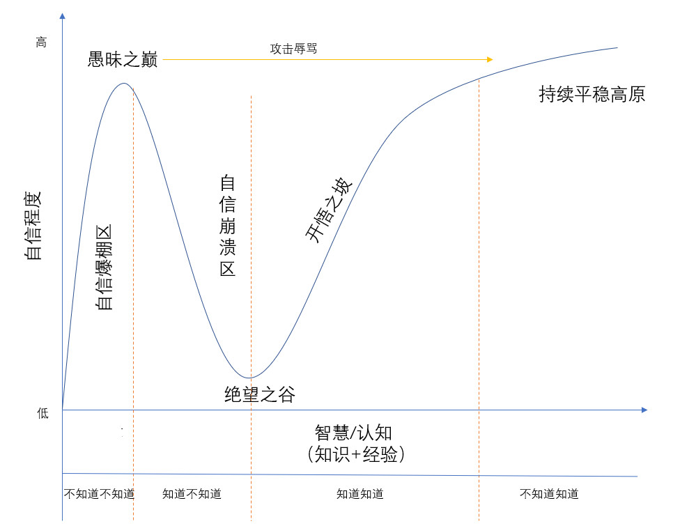

# 成为学生

## 愚昧之巅与绝望之谷

大学毕业之后，我随波逐流的随便找了家公司工作，因为公司要求学了Delphi、C#之类的几种编程语言，然后过了几年朝九晚五的安逸生活。

工作的压力不大，技术要求也不高，非科班毕业的同事也能体面的完成编程工作，我甚至每周只要工作几小时就能完成本周的任务，并为我自己能有摸鱼的时间而洋洋自得。

本以为生活会这样平静的继续下去，直到有一次，跟在微软工作的同学聊天时，发现很多随口说出来的名词自己根本连听都没听说过，一些我原本以为没有人会真的弄懂的原理知识，对方也是信手拈来。

这次谈话让我陷入了深深的自我怀疑。

在写下这段经历的时候，我才意识到，自己当时正处在“愚昧之巅”而不自知。

<figure><figcaption></figcaption></figure>

自从那次聊天之后，我开始把绝大部分上班摸鱼和下班玩游戏的时间都用来学习，用了一年多的时间，把几乎所有专业课都重新学习和拓展了一遍（所以才有了上一章内容），甚至还学了很多其他技术方向的东西（比如说游戏引擎，或者嵌入式编程）。这段经历后来彻底改变了我的职业生涯，当然那又是另一个故事了。

## 迈向开悟之坡

工作三年是个有趣的时间点，根据我这些年的观察，绝大多数程序员在工作三年时都会产生一种“什么都懂了，但好像又不是很懂”的困惑。

毕业之后，角色由学生转变为了工作者，不再有类似教学大纲的学习指导，工作中绝大多数的“培养”也不是教学，而是选拔，被动接触知识的机会变少了。

从另一方面，工作三年，绝大多数人已经适应了工作内容，并且能独立完成一些事情；同时，绝大多数人工作的前三年只能被动的被工作要求推动着了解新知识，因此，绝大多数人的技术视野也会被局限在工作相关的部分上。

但是，程序员所处的计算机行业是大规模的、前沿的、并且仍然在持续发展（至少现在还是如此）的行业，依靠在某个公司工作三年积累下来的某个细分领域的经验，如果从行业视角来评估的话，也许只能达到“入门”的状态。

我之前给大多数处在“三年之痒”的程序员的建议都是类似的：迈入工作岗位并不意味着学生角色的终结，而是另一段学习历程的开始，只有通过自主的、持续的、系统化的学习，才能识破愚昧之巅，攀过绝望之谷，迈向开悟之坡。

### 自我评价与设定目标

相对于在校生，要成为广义上自主学习的“学生”，最大的区别，或者说最大的困难，在于决定学什么东西：每个人的既有知识、工作内容、发展方向甚至生活状态都是不同的，很难给出一个通用的，适用于所有人的学习大纲。

因此，在工作以后，学习的第一个目标是知道自己应该学什么。如果把这个问题再进一步分解，就是“知道自己什么水平”和“想让自己达到什么水平”，中间的差距，就是要学习的部分。

```
待学习 = 目标 - 自我评价
```

#### 自我评价

> 前些天，团队里的同学找我沟通绩效，他希望我能对他当前的能力水平做一个评价，他看看还有什么地方需要提升。
>
> 我的回复是，我可以给你做一个看似中肯的评价，但是无论我给你的评价是“好”、“中”还是“差”，意义都不大。因为我只是你的领导，不是你的导师，我不能保证自己能够准确的评价每个人的能力水平，即使可以做到，这件事也很难长期维持下去。
>
> 如果希望我给你指导，那么我更希望让你掌握的是“怎么客观的评价自己的能力水平”。

对于在校生来说，考试成绩是个很好的自我评价工具：它能基本客观的反映出你对某个知识的掌握程度，以及自己和他人的对比。但是，工作中很难有这种客观的评价指标（这部分内容容我后面章节再讲）。而除了考试这类方法，其他的评价体系会因为不同人的岗位和工作内容不同，不同的领导也会有各自的偏好，等等这些原因，限制了评价的准确性。

但好消息是，自我评价这件事情，不需要精准的获取客观评分，只需要知道哪里需要优化就可以了。因此，有几个手段可以试试：

* 对比他人：通过与其他人沟通，或者对比成果，发现差距（比如因为一次聊天而陷入了绝望之谷的我）
* 自我提问：尝试扮演其他角色（比如老板或者利益冲突方），对自己进行提问
* 自我总结：定期对问题进行总结，输出到文章或者知识库；或者定期更新自己的简历（关于简历的内容会在下一章涉及）

在我看来，自我评价更像是跟自己的搏斗，对打的时间越长，就越能了解对手（听起来就像《搏击俱乐部》里的剧情）。当然，无论是否希望做自我评价，随着时间的增长，每个人或早或晚也都会遇到自己的“绝望之谷”时刻。

#### 设定目标

我跟很多人沟通过职业发展方面的规划，得到的答案大多是含蓄而模糊的。很多人错误的把“发展”和“长大”这两个词混为一谈，以至于他们的职业发展就是“先干三年再说”。

另一方面，很多人直接把目标当做了行动计划（比如要看完一本书），这也会使得目标不再具备指导学习的能力。

我的建议是，初期的目标可以设定成身边的“我想要成为的人”，在接触过程中找到对方强于自己的知识或能力，再把这些内容转化为可执行的行动计划，非常简单的策略，但是（至少我使用下来）非常有效。

需要注意的是，对标的应该是周围的人，而不是某个大神，或者只是听说过名字的人。只有跟具体的、经常打交道的人对标，才能总结出具体的、可描述的差距，跟一个符号化的人物对标做不到这一点。

当对标过几个人，进行了几轮的自我突破之后，后面应该就不用再去找人对标了 -- 知道的越多，越能发现自己的无知，也越能发现当前的问题。对于设定目标来说，这是好事。

### 学习的手段

自学和在校学习的一个重要区别就是，自学的手段有很多种，他们之间的效率相差极大。

如果按推荐程度排名的话，我的建议是：

* 书籍
* 论文（或官方文档）
* 某个大神的系列教程
* 碎片化的知识

区别于在校生，当我们作为“专业人士”学习时，知识的体系化程度要比一两个技术点重要的多。有了知识体系，就能通过类比、对比、实践经验等方法，大幅度提升学习的效率。

因此，我最推荐书籍这种已经把知识做过结构化梳理的资料作为第一手的学习资料，论文或者文档（通过引用和链接）、大神的系列教程也有类似的效果。

但是，对于碎片化的知识（比如短视频、或者某篇文章），虽然学习门槛最低，但是却很难能对知识体系有贡献，我建议只作为“听说”的介质，而不是学习的途径。

同时，对于所有资料，更建议阅读原版内容，而不是中文版或翻译器版本，尤其是英文翻译成中文出版内容，要慎重选择。

> 如果想要提升英文阅读能力，我的经验是，可以试试找一本纯英文并且已经被翻译成中文的经典书籍，自己试着翻译上一两章，并且对比中文版纠错，之后阅读能力会有脱胎换骨的变化。

## 成为学生

在这一章的最后，我想简单总结一下程序员与学生的关系：

一名优秀的程序员，应该是具有良好教育背景的、经过院校专业课学习的、具备长期自我驱动学习能力的人。

甚至可以说，作为程序员的乐趣之一，就是学习的乐趣。
