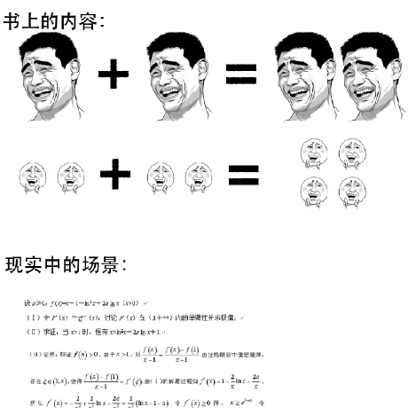

# 理解专业课

## 软件交付与维护

### 软件工程

[维基百科](https://zh.wikipedia.org/wiki/%E8%BD%AF%E4%BB%B6%E5%B7%A5%E7%A8%8B)上对软件工程的起源有着比较详细的说明：

> 1960年代中期开始爆发众所周知的软件危机，[硬件](https://zh.wikipedia.org/wiki/%E7%A1%AC%E9%AB%94)成长率每年大约30％，软件每年只勉强以4～7％速度在成长，[信息系统](https://zh.wikipedia.org/wiki/%E8%B3%87%E8%A8%8A%E7%B3%BB%E7%B5%B1)的交付日期一再延后，许多待开发的软件系统无法如期开始。1960年代软件开发成本占总成本20％以下；1970年代软件成本已达总成本80％以上，软件维护费用在软件[成本](https://zh.wikipedia.org/wiki/%E6%88%90%E6%9C%AC)中高达65％。1986年公布的数据，所有验收的[外包](https://zh.wikipedia.org/wiki/%E5%A4%96%E5%8C%85)软件中，竟然只有4％可用，其余96％却是不堪一用。大部分的企业自行开发的信息系统中，有四分之三也是功败垂成。因此[软件](https://zh.wikipedia.org/wiki/%E8%BB%9F%E9%AB%94)维护成本居高不下，软件产品[质量](https://zh.wikipedia.org/wiki/%E5%93%81%E8%B3%AA)低落是最主要的原因。
>
> 1968年秋季，NATO（北约）的科技委员会召集了近50名一流的编程人员、计算机科学家和工业界巨头，讨论和制定摆脱“[软件危机](https://zh.wikipedia.org/wiki/%E8%BB%9F%E9%AB%94%E5%8D%B1%E6%A9%9F)”的对策。在那次会议上第一次提出了软件工程（software engineering）这个[概念](https://zh.wikipedia.org/wiki/%E6%A6%82%E5%BF%B5)，研究和应用如何以系统性的、规范化的、可定量的过程化方法去开发和维护软件，以及如何把经过时间考验而证明正确的管理技术和当前能够得到的最好的技术方法结合起来的学科。

简单来说，就是软件工程出现之前，编程是一门手艺，但是由于技术发展太快，手艺人经常把事情搞砸。软件工程出现之后，定义了软件的生命周期、软件开发的流程、以及整理了大量的软件开发最佳实践，最终得以让“软件开发”这件事情完成了由手艺人独立接单到社会化大规模生产的转变。

《软件工程》就是教授软件开发的工程方法的课程，通过学习软件工程，可以更“规范”的进行软件开发活动。

但是，软件工程课程本身涵盖的方面太多，因此对于具体的编程的核心过程：设计与开发，介绍的比较粗浅。

## 软件的设计与开发

### 面向对象程序设计

在介绍《面向对象程序设计》这门课之前，要先理解一下“设计”与“实现”的区别。

可以把程序设计类比成建筑设计：建筑设计师通过图纸、文档描述建筑的建造方案，程序设计师通过UML图、规格文档等描述软件的建造方案。

> 注意：无论是建筑设计师、还是程序设计师，完成设计以后，他们的设计方案都还没有变成实际的建筑或代码。这在建筑设计的语境里很好理解，但令人惊讶的是，相当多的程序员在工作几年之后，仍然没有理解“程序设计”和“程序开发”之间的区别。

如果按这种方式区分，标题中的《面向对象程序设计》，可以理解为“面向对象程序的设计”，课程中前半部分是介绍面向对象程序中的各种概念和语法，比如类、接口、泛型等，后一部分介绍的是基于面向对象的思想，如何用面向对象中的各种概念描述现实问题。

进一步讲，面向对象中的“面向”，某种程度上可以改成“基于”，除了基于对象的设计，还有基于过程的，或者基于函数的。三者的本质都是让编程语言脱离了计算机的具体工作原理，而是提供了某种高层次的抽象概念，程序员把现实中存在的场景或问题，映射到这种更好理解的概念中（而不是更灰色的计算机指令流水线），就完成了程序的设计。

> 之所以目前面向对象更受欢迎，更多的是因为“面向对象”的建模思路与真实世界更加相近，设计的门槛更低。如果有条件，建议更进一步学习函数式编程的设计方法，在某些更偏向于“解决问题”而不是“表达问题”的场景下会更有效率。

但是，面向对象程序设计这门课程对于“程序”和“设计”都没有很深入的讲解下去。

对于程序，绝大多数院校会开设前导课程，比如C语言基础，后面会讲到。

而设计是个需要经验积累的能力，《面向对象程序设计》对于设计的讨论是不足的，仅讨论了基本的概念和思想，很多院校也没有后置的设计课程。因此才导致了大量程序员不懂设计、不会设计也不想设计。

<figure><figcaption></figcaption></figure>

#### 面向对象设计模式

据我了解，仅有部分高校开设了《面向对象设计模式》课程，这门课程本质上是“程序设计原理”与“程序设计实践”的桥梁。

某种程度上，也可以把“设计模式”可以换成“设计案例”，虽然大部分设计模式书里仅有十几种，但这些极具代表性的设计案例，可以覆盖相当多的程序设计场景，也可以作为进一步理解面向对象（或者其他）设计思想的参考。

因此，我建议学习完面向对象程序设计之后，抽时间学习一下《面向对象设计模式》。
