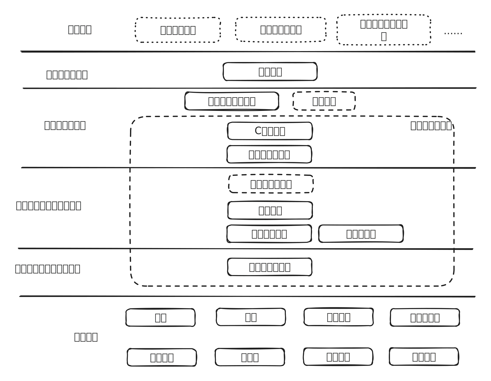

# 专业课

如愿选上了计算机科学与技术专业，来到大学以后，前两年的课程安排跟我想象中的相距甚远。

本以为可以在大学里系统的学习计算机和软件开发知识，结果前两年安排的都是数学、物理之类的基础课，甚至经济学、管理学之类的不是理工科的课程。

于是大学的前两年我基本都是在通宵游戏和白天睡觉的状态下度过的，在课堂上的睡眠质量出奇的高，有一次甚至睡过了头：在高数课上课的时候睡着，醒来的时候发现教室里是另一个专业的物理课正要下课。

这样浑浑噩噩的两年过去之后才终于迎来了期盼已久的专业课，但是很快之后我又发现了另一个问题：专业课虽然跟计算机有关系，但是我也说不清楚学习它对于“我”的意义到底是什么，虽然我每一门专业课的成绩都还不错，但是直到毕业，我也仍然感觉每一门专业课是一个割裂的知识体系。

在毕业之后工作了很久，我才逐渐把“知识”和“应用”逐渐联系起来，形成一个完整的知识体系。

本以为这可能是我的个例问题，但是经过我这些年的面试，我发现绝大多数学生都没能把专业知识和实际场景联系起来。

计算机方向的大学课程，大概可以分为几类：

* 通识课，包括体育、外语、思想政治等
* 基础课，包括高等数学、大学物理、线性代数等
* 专业课，包括数据结构、操作系统、软件工程等

在这里先忽略通识课程，剩下的基础课与专业课之间大多数是部分递进的关系，也就是说后面的课程会依赖前面课程的某些部分。按照常规的教学体系，在刚入学时会学习基础课，之后学习专业课，最后是实践或实习。但是按照这个顺序学习下来，在学习前面的基础课程时，我几乎每天会产生“我学这个到底是有什么用”的困惑。

同时，（在我的那个年代）有些专业课的教材写的过于晦涩难懂（每一个被谭浩强弄疯过的人都懂），这也让专业知识变成了死记硬背的文字，而不是能够应用于生产的工具。

因此，在这一章的后半部分，我会尽可能的对计算机的知识体系做一次梳理，捋清楚专业知识之间的关系，并且推荐一些替代或者补充教材。

如果回过头来看，以开发工程师为例，他的专业知识可以分为几个部分：

* 计算机的运行原理
* 程序的设计及开发
* 程序的交付与维护
* 领域相关知识（数据库、多媒体、机器学习等）
* 其他软技能（沟通、汇报等）

这些技能彼此区别，但也互相联系，如果从更高的视角把软件工程师的专业技能和专业课放在一张图里，那么大概是这个样子：

接下来，让我们从通用专业课（不考虑领域知识）的最上层：软件工程开始，逐步分解课程之间的依赖关系。
